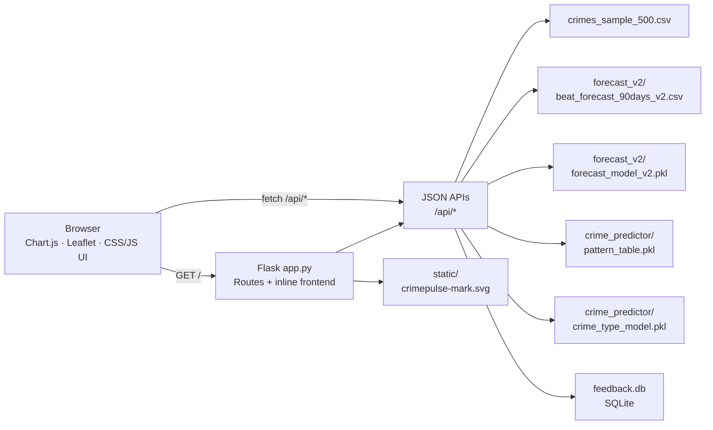
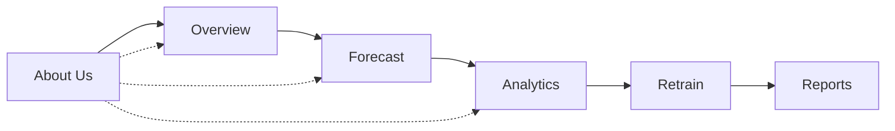
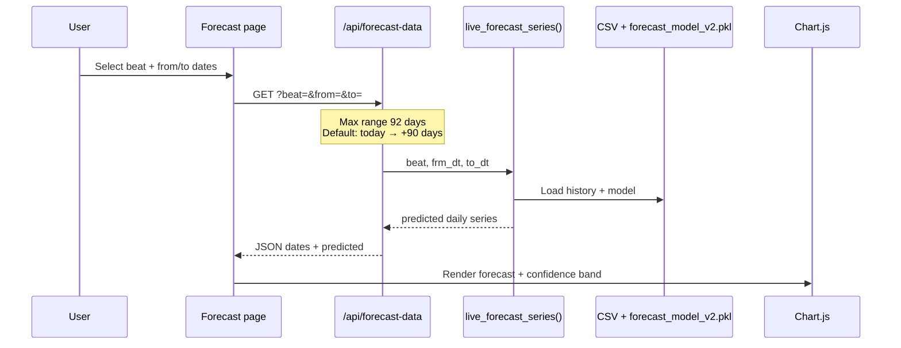

# 🚨 CrimePulse


**CrimePulse** turns Chicago’s historical crime data into beat-level forecasts, risk rankings, maps, analytics, and model-feedback views — an MCA project dashboard for crime awareness and forecasting.

| | |
|---|---|
| 🏙️ **City** | Chicago |
| 🗺️ **Coverage** | 305 police beats |
| 📊 **Historical data** | 7M+ records, 2001–2026 |
| 📅 **Forecast horizon** | Live, on-demand ranges up to 92 days |
| 💾 **Local data store** | SQLite (`feedback.db`) |
| ✉️ **Contact** | [divymakwana375@gmail.com](mailto:divymakwana375@gmail.com) |

> ⚠️ **Disclaimer:** CrimePulse is an educational analytics project. It is not an official Chicago Police Department product, emergency service, or safety recommendation.

---

## 🧭 Current product

The app opens on **About Us**, followed by five working product areas:

### 👋 About Us
- CrimePulse hero, product explanation, strengths, and limitations
- Site-wide header, sidebar, footer, social icons, and contact email
- Responsive mobile drawer

### 📈 Overview
- Predicted incident total
- Highest-risk beat
- Current risk gauge
- Recent activity
- Beat-level search and crime profile
- Top-10 risky beats chart with sorting

### 🔮 Forecast
- Live forecast for a selected beat and date range
- Defaults to today through the next 90 days
- Confidence band and summary metrics
- Recursively generates predictions beyond the original pre-generated CSV window

### 📊 Analytics
- Leaflet crime map with crime-type and area filters
- Real hour-by-day heatmap
- Real time-of-day radar chart
- LightGBM feature-importance chart

> 🗑️ The earlier DBSCAN hotspot layer was intentionally removed.

### 🔄 Retrain and model health
- Accepts observed crime information and an `actual_count`
- Stores feedback in SQLite
- Compares predicted vs actual counts
- Displays MAE, bias, and model-health charts when observed feedback exists

### 📋 Reports
- Combined historical sample and user feedback
- Search, filters, pagination, and summary charts
- CSV, JSON, and SQLite downloads

---

## 🎨 UI and interaction

- CrimePulse brand and custom SVG mark
- Dark glass/depth visual system
- Manrope and Space Grotesk typography
- Crimson risk accent, teal secondary accent, and blue information accent
- Card tilt, entrance animations, KPI count-up, chart animation, and button feedback
- `prefers-reduced-motion` support
- Desktop and mobile layouts

💡 Three.js/WebGL effects are not used. A prototype was tested and then removed to keep navigation fast and stable. The current interface uses CSS and lightweight JavaScript motion.

---

## 🖥️ How to run on Windows

### ✅ Existing virtual environment

```powershell
cd C:\Users\DIVY\OneDrive\Desktop\mca\study\sem4\project1\project

Set-ExecutionPolicy -Scope Process -ExecutionPolicy Bypass
.\crime_env\Scripts\Activate.ps1

pip install -r requirements.txt
python app.py
```

Open:

```text
http://localhost:5000
```

📂 All application data paths resolve relative to `app.py`, so the project folder can be moved to another machine.

### 🆕 Create a new environment

```powershell
python -m venv crime_env
Set-ExecutionPolicy -Scope Process -ExecutionPolicy Bypass
.\crime_env\Scripts\Activate.ps1
pip install -r requirements.txt
python app.py
```

---

## 📦 Dependencies

Pinned in `requirements.txt`:

| Package | Version |
|---|---|
| Flask | 3.1.3 |
| pandas | 3.0.1 |
| NumPy | 2.4.3 |
| joblib | 1.5.3 |
| scikit-learn | 1.8.0 |
| LightGBM | 4.6.0 |

Frontend libraries are loaded by the app:

| Library | Version |
|---|---|
| Chart.js | 4.4 |
| Leaflet | 1.9.4 |

---

## 📁 Project structure

```text
project/
├── app.py                         # Flask routes + inline HTML/CSS/JS
├── beat_crime_predictor.py        # Beat-level crime prediction workflow
├── crime_forecast_v2.py           # Forecast training/generation workflow
├── cleanup.py                     # Data cleanup utility
├── requirements.txt               # Pinned Python dependencies
├── README.md                      # Complete project documentation
├── new_plan.md                    # Pointer to this README
├── report.md                      # Pointer to this README
├── crimes_sample_500.csv          # Dashboard sample data
├── feedback.db                    # Local SQLite feedback (generated locally)
├── static/
│   └── crimepulse-mark.svg        # Brand mark and favicon
├── crime_predictor/
│   ├── pattern_table.pkl          # Historical pattern artifact (local/ignored)
│   └── crime_type_model.pkl       # Crime-type model when available
└── forecast_v2/
    ├── beat_forecast_90days_v2.csv
    └── forecast_model_v2.pkl      # Bootstrapped locally if missing
```

🔒 Large datasets, local feedback, the virtual environment, and generated model artifacts are excluded from Git where appropriate.

---

## 🗄️ Data

### 🔗 Source

[Chicago Data Portal — Crimes 2001 to Present](https://data.cityofchicago.org/Public-Safety/Crimes-2001-to-Present/ijzp-q8t2)

### 📑 Dataset summary

| Property | Value |
|---|---|
| Original file | `Crimes_-_2001_to_Present_20260312.csv` |
| Original size | Approximately 2.20 GB |
| Records | Approximately 7 million |
| Columns | 22 |
| Date range | 2001–2026 |
| Police beats | 305 |
| Crime types | 33 total; top 15 used for classification |

Important source columns:

- `Date`
- `Primary Type`
- `Beat`
- `District`
- `Ward`
- `Community Area`
- `Arrest`
- `Location Description`
- `Latitude`
- `Longitude`

### 🧹 Cleaning

| Problem | Handling |
|---|---|
| Missing latitude/longitude | Median imputation |
| Missing location description | Filled with `OTHER` |
| Duplicate rows | Removed |
| Date strings | Parsed into year, month, day, hour, and weekday |
| Coordinate outliers | Restricted to valid Chicago bounds |

📦 The full cleaned dataset is too large for normal GitHub storage and is not included in the repository.

---

## ⚙️ Feature engineering

Features derived from time and location include:

- `Month`, `Hour`, and `DayOfWeek`
- `IsWeekend`
- `IsNight`
- `IsRushHour`
- `Beat_Hour`
- `District_Hour`
- `Hour_sin` / `Hour_cos`
- `Month_sin` / `Month_cos`
- `beat_month_avg`
- `beat_dow_avg`
- lag and rolling features for recursive forecasting

---

## 🤖 Models and results

### 🏷️ Crime-type prediction

**Goal:** predict the most likely crime type from location and time.

| Model | Approximate accuracy | Notes |
|---|---:|---|
| Logistic Regression | 25% | Baseline |
| Random Forest | 40% | Improved nonlinear model |
| LightGBM | 40% | Best trained classifier |
| Neural Network | 36% | Overfit |
| Historical beat/month pattern | 60%+ | Best overall approach |

🎲 With 15 target classes, random guessing is approximately 6.6%. Historical beat and month patterns produced the strongest crime-type result.

### 📉 Crime-count forecasting

**Goal:** forecast daily crimes for a beat and date.

| Model | MAE | RMSE |
|---|---:|---:|
| Gradient Boosting V1 | Approximately 2.1 | Approximately 3.2 |
| LightGBM V2 | 1.06 | 1.49 |

✨ An MAE of 1.06 means the daily beat-level forecast differs from the observed count by approximately one crime on average in the reported evaluation.

**Top forecast drivers:**

1. `beat_dow_avg`
2. `day`
3. `year`
4. `weekofyear`
5. `beat_month_avg`

---

## 🔍 Example beat insights

### Beat 1925

```text
Expected crimes: approximately 1 per day
Likely crime: THEFT
Historical pattern probability: approximately 57%
Reported risk rank: 58 of 305
```

### Beat 1834

```text
Expected crimes: approximately 7 per day
Likely crime: THEFT
Historical pattern probability: approximately 70%
Reported risk rank: 1 of 305
Original 90-day forecast: 568 crimes
```

### Beat 123

```text
Expected crimes: approximately 4 per day
Likely crime: THEFT
Historical pattern probability: approximately 67%
Reported risk rank: 2 of 305
```

---

## 🏆 Original top-10 forecast snapshot

This table describes the saved 90-day forecast snapshot used in the project report. Live on-demand results vary with the requested date range.

| Rank | Beat | Predicted crimes | Top crime |
|---:|---:|---:|---|
| 1 | 1834 | 568 | THEFT |
| 2 | 123 | 439 | THEFT |
| 3 | 421 | 425 | BATTERY |
| 4 | 1831 | 395 | THEFT |
| 5 | 823 | 378 | BATTERY |
| 6 | 1924 | 370 | BATTERY |
| 7 | 612 | 362 | BATTERY |
| 8 | 631 | 362 | BATTERY |
| 9 | 624 | 359 | BATTERY |
| 10 | 331 | 358 | BATTERY |

---

## 🏗️ Architecture

`app.py` contains the Flask backend and the inline frontend (HTML/CSS/JS served from one process). Diagrams below use [Mermaid](https://mermaid.js.org/) and render in GitHub and Cursor preview.

### 🖥️ System architecture



### 🧭 App navigation map

Single-page dashboard: header buttons call `showPage(...)` to swap views (no separate URL per page).



### 🔮 Live forecast request flow



### 🔌 Main API routes

| Route | Purpose |
|---|---|
| `/api/top-beats` | Top risky beats |
| `/api/beat-detail` | Beat profile |
| `/api/forecast-data` | Live date-range forecast |
| `/api/recent-activity` | Overview feed |
| `/api/map-data` | Filtered map markers |
| `/api/heatmap` | Real hour-by-day matrix |
| `/api/radar` | Time-of-day crime pattern |
| `/api/feature-importance` | Model explainability |
| `/api/model-metrics` | Prediction-vs-actual metrics |
| `/api/feedback` | Save feedback and observed count |
| `/api/feedback-list` | Feedback records |
| `/api/merged-data` | Combined report data |
| `/api/download-combined-csv` | CSV export |
| `/api/download-combined-json` | JSON export |
| `/api/feedback-download` | SQLite download |

---

## ⚠️ Limitations

- Forecasts are estimates and may differ from actual events.
- Crime patterns can change due to policy, reporting, seasonality, and external events.
- The dashboard sample does not contain every full-dataset row.
- Internet access is required for map tiles, web fonts, and CDN frontend libraries.
- The local Flask development server is for development/demo use.
- CrimePulse must not be used as emergency or official police guidance.

---

## 🎯 Final project outcome

| Goal | Result |
|---|---|
| Crime-count prediction | LightGBM V2, reported MAE 1.06 |
| Crime-type prediction | Historical pattern approach, reported 60%+ |
| Beat risk ranking | 305 beats |
| Forecast | Live on-demand range up to 92 days |
| Analytics | Map, heatmap, radar, feature importance |
| Feedback | SQLite prediction-vs-actual workflow |
| Web product | Responsive Flask dashboard |

CrimePulse combines a complete ML workflow with a browser-based product suitable for project demonstration, model explanation, and beat-level crime-pattern exploration.
