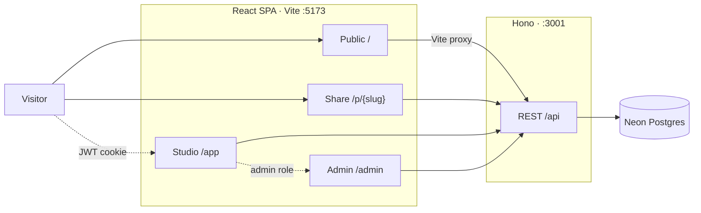

# TravelMind

**Plan multi-city trips as one story — itinerary, budget, packing, and notes in one place.**

TravelMind is a local itinerary studio, not a booking marketplace. There are no fares, hotels, or live bookings. You name a journey, choose a **primary destination** (required), then add more cities once each, in order. Activities attach to the stop they belong to. Budget, packing, and notes live on the same trip.

The public home is `/`. The signed-in studio is `/app`. When a trip is ready to be seen, set it public and share `/p/:slug`.

---

## Features

### Public

- Landing page with featured destinations from the catalog
- Sign in, sign up, and local forgot-password (demo reset token; no email is sent)
- Public share view at `/p/:slug` — read-only itinerary
- Signed-in visitors can copy a public trip into their own library

### Studio (requires sign-in)

- Dashboard (`/app`) — upcoming trip, catalog suggestions, saved cities
- Create a trip with a **primary destination** as stop zero
- Multi-city itinerary: list and calendar views
- Country → state → city picker (gazetteer via `country-state-city`) plus catalog search
- **One city per trip** — the same city cannot be added twice
- Catalog activities per stop (sightseeing, food, culture, adventure, nightlife)
- Leaflet + OpenStreetMap map of trip stops
- Budget: stay, transport, meals per day, activity costs, daily cap
- Packing checklist by category, with a reset-to-defaults action
- Trip notes (optionally tied to a stop)
- Save destinations to a personal list
- Profile: name, language, password, delete account
- Light / dark theme (`travelmind-theme` in `localStorage`, else system preference)

### Admin (role `admin` only)

- Ledger at `/admin`: catalog pulse, 14-day charts, atlas, people and roles
- Promote or demote other users (`user` / `admin`); you cannot change your own role

### Catalog (seeded)

| | Count |
|---|---|
| Cities | 219 |
| Countries | 82 |
| Regions / states | 182 |
| Activities | 964 (4–5 per city) |

You can also add cities that are not in the seed. The API resolves them from the gazetteer and creates a catalog row plus generic activities.

---

## Architecture

Two processes in one repo. The browser only talks to Vite. Vite proxies `/api` to Hono. Hono talks to Neon Postgres.



| Process | Port | Role |
|---|---|---|
| Vite (React SPA) | `5173` | UI; proxies `/api` → `127.0.0.1:3001` |
| Hono on Node | `3001` | REST API, auth cookies, Drizzle queries |
| Neon Postgres | cloud | Users, catalog, trips, packing, notes |

CORS on the API allows `http://localhost:5173` and `http://127.0.0.1:5173` with credentials.

### Access control

| Area | Who |
|---|---|
| `/`, `/login`, `/signup`, `/forgot-password`, `/p/:slug` | Anyone |
| `/app` and the rest of the studio | Signed-in user (`Protected` → `/login` if not) |
| `/admin` | `role === "admin"` (else redirect to `/app`) |
| `GET /api/admin/*` and `PATCH /api/admin/users/:id` | Admin on the API, otherwise **403** |

Session cookie: `tl_token` (httpOnly, `SameSite=Lax`, JWT, 14 days).

---

## Tech stack

| Layer | Stack |
|---|---|
| **UI** | React 19, TypeScript, Vite 7, React Router 7 |
| **Styling** | Tailwind CSS 4 (`@tailwindcss/vite`), custom tokens (paper, sage, gold) |
| **Fonts** | Manrope (sans), Newsreader (serif) via Google Fonts |
| **Maps** | Leaflet + OpenStreetMap |
| **API** | Hono 4 on Node (`@hono/node-server`), run with `tsx` |
| **Database** | Neon serverless Postgres (`@neondatabase/serverless`) |
| **ORM** | Drizzle ORM + drizzle-kit (`drizzle-kit push`, no checked-in migrations) |
| **Auth** | `jsonwebtoken` cookie + `bcryptjs` password hashes |
| **Geo** | `country-state-city` gazetteer |
| **Dev** | `concurrently` (API + Vite together) |

---

## Pages

| Route | Screen | Auth |
|---|---|---|
| `/` | Public home | No |
| `/login` `/signup` `/forgot-password` | Auth | No |
| `/p/:slug` | Public share view | No |
| `/app` | Dashboard (studio desk) | Yes |
| `/trips` | Trip list | Yes |
| `/trips/new` | Create trip + primary city | Yes |
| `/trips/:id` | Itinerary (list / calendar) | Yes |
| `/trips/:id/plan` | Planner | Yes |
| `/trips/:id/cities` | Add / browse cities | Yes |
| `/trips/:id/stops/:stopId/activities` | Add activities to a stop | Yes |
| `/trips/:id/budget` | Budget | Yes |
| `/trips/:id/packing` | Packing list | Yes |
| `/trips/:id/notes` | Notes | Yes |
| `/profile` | Account | Yes |
| `/admin` | Admin ledger | Admin |
| `/home` | Redirects to `/app` | Yes |

Unknown paths redirect to `/`.

---

## Data model

Schema lives in `server/schema.ts`. Drizzle **pushes** the schema to Neon (`npm run db:push`); there is no committed `drizzle/` migration folder.

| Table | Purpose |
|---|---|
| `users` | Email, password hash, name, language, `role` (`user` / `admin`), optional reset token |
| `cities` | Catalog place: country, region, cost index, popularity, lat/lng, image, description |
| `activities` | Per-city activities (`sightseeing`, `food`, `culture`, `adventure`, `nightlife`) |
| `trips` | Journey owned by a user; dates, budget cap, visibility, unique `share_slug` |
| `trip_stops` | Ordered city stays with stay / transport / meals cost |
| `stop_activities` | Activities hung on a stop (optional date, time, cost override) |
| `packing_items` | Checklist rows (category, packed flag) |
| `trip_notes` | Journal entries, optionally linked to a stop |
| `saved_destinations` | User bookmarks for catalog cities |

Deleting a user or trip cascades to related rows. Notes keep the text if a stop is deleted (`stop_id` set null).

---

## API

Base path: `/api` (via Vite proxy in development). JSON in / JSON out. Cookie session on mutating and private routes.

### Health and geo

| Method | Path | Auth | Notes |
|---|---|---|---|
| `GET` | `/api/health` | No | `{ ok: true, name: "TravelMind" }` |
| `GET` | `/api/geo/countries` | No | ISO countries |
| `GET` | `/api/geo/states?country=` | No | States / regions |
| `GET` | `/api/geo/cities?country=&state=` | No | Cities in that region |

### Auth and profile

| Method | Path | Auth | Notes |
|---|---|---|---|
| `POST` | `/api/auth/signup` | No | Name, email, password (min 6 chars); sets cookie |
| `POST` | `/api/auth/login` | No | Sets `tl_token` cookie |
| `POST` | `/api/auth/logout` | — | Clears cookie |
| `POST` | `/api/auth/forgot` | No | Local demo: returns `demoToken` if the email exists |
| `POST` | `/api/auth/reset` | No | Token + new password |
| `GET` | `/api/me` | Yes | Current user + saved destinations |
| `PATCH` | `/api/me` | Yes | Profile fields |
| `DELETE` | `/api/me` | Yes | Delete account |

### Catalog, trips, packing, notes

| Method | Path | Auth | Notes |
|---|---|---|---|
| `GET` | `/api/cities` | — | Search / list catalog |
| `GET` | `/api/cities/:id/activities` | — | Activities for a city |
| `GET` / `POST` | `/api/trips` | Yes | List / create (primary destination required) |
| `GET` / `PATCH` / `DELETE` | `/api/trips/:id` | Owner | Hydrated trip |
| `POST` | `/api/trips/:id/copy` | Yes | Duplicate into your library |
| `POST` | `/api/trips/:id/stops` | Owner | Add a city (rejects duplicates) |
| `PATCH` | `/api/stops/:id` | Owner | Dates, costs |
| `POST` | `/api/stops/:id/move` | Owner | Reorder |
| `DELETE` | `/api/stops/:id` | Owner | Remove stop |
| `POST` | `/api/stops/:id/activities` | Owner | Attach catalog activity |
| `DELETE` | `/api/stop-activities/:id` | Owner | Detach |
| `GET` / `POST` | `/api/trips/:id/packing` | Owner | List / add item |
| `PATCH` / `DELETE` | `/api/packing/:id` | Owner | Toggle / remove |
| `POST` | `/api/trips/:id/packing/reset` | Owner | Restore default starter items |
| `POST` | `/api/trips/:id/notes` | Owner | Add note |
| `PATCH` / `DELETE` | `/api/notes/:id` | Owner | Edit / remove |
| `POST` | `/api/saved` | Yes | Bookmark a city |
| `DELETE` | `/api/saved/:cityId` | Yes | Unsave |

### Public share and admin

| Method | Path | Auth | Notes |
|---|---|---|---|
| `GET` | `/api/public/:slug` | No | Public trip if `visibility` is public |
| `POST` | `/api/public/:slug/copy` | Yes | Copy into your library |
| `GET` | `/api/admin/stats` | Admin | Aggregates, 14-day series, roster |
| `PATCH` | `/api/admin/users/:id` | Admin | Set `user` or `admin` (not yourself) |

---

## Environment variables

Copy `.env.example` to `.env`:

| Variable | Required | Purpose |
|---|---|---|
| `DATABASE_URL` | Yes | Neon Postgres connection string (`sslmode=require`) |
| `JWT_SECRET` | Yes | Signing key for session tokens |
| `PORT` | No | API port (default `3001`) |
| `STITCH_API_KEY` | No | Only for `npm run stitch:design` |

Never commit `.env`.

---

## Run locally

1. Create a [Neon](https://neon.tech) project and copy the connection string.
2. Copy `.env.example` to `.env`. Set `DATABASE_URL` and `JWT_SECRET`.
3. Install dependencies:

```bash
npm install
```

4. Push the schema, then seed the catalog:

```bash
npm run db:push
npm run db:seed
```

5. Start API + Vite together:

```bash
npm run dev
```

Open [http://localhost:5173](http://localhost:5173). The UI proxies `/api` to `http://127.0.0.1:3001`.

Seed takes a while on first run: it resolves Wikipedia place photographs for the catalog. Sign up from `/signup` to open the studio. New accounts are `user`; an admin can promote someone from `/admin`.

---

## Admin ledger (`/admin`)

Sign in with an account whose role is `admin`, then open **Admin** from the shell.

| Section | Contents |
|---|---|
| **Hero** | Greeting, catalog counts, still of the most-chosen city |
| **Ledger** | Travelers, journeys, public share rate, stops; 14-day signups vs new trips; public/private mix; activity types |
| **Atlas** | Ranked cities and countries, favoured activities |
| **Studio** | Packing and journal pulse, recent journeys |
| **People** | Roster with search and Traveler / Admin filter. Role pills change others only. |

---

## What this is not

TravelMind does not scrape fares, inventory hotels, send real email, or deploy as a marketplace. It is a local studio: compose trips, seed a catalog, optionally share a public itinerary.
